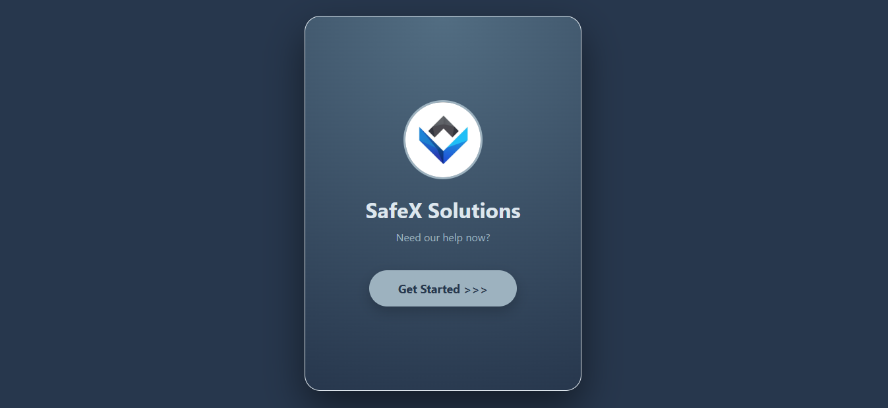
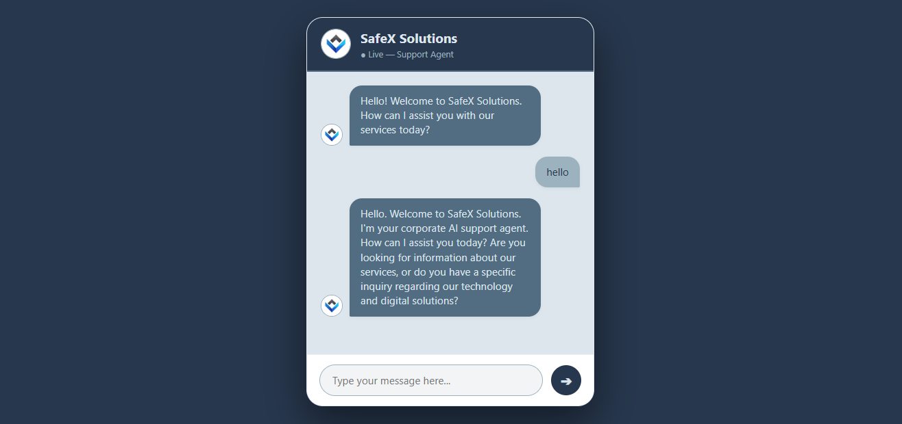

# PORTFOLIO CASE STUDY: SafeX Solutions AI Support Agent

## Project Overview
* **Role:** Lead AI DevOps & Backend Engineer
* **Objective:** Build and deploy a secure, ultra-low latency corporate AI support agent that utilizes internal enterprise files without data leakages or hallucinated technical specs.
* **Core Tech Stack:** FastAPI, LangChain Core, Groq (Llama 3 inference), Hugging Face Embeddings, NumPy, Docker, YAML.

---

## The Challenge (The Problem)
When standard LLM-based chatbots are deployed for enterprise or customer support, they suffer from two fatal issues:
1. **Hallucinations:** The models "guess" technical answers based on generic training data rather than true company protocols.
2. **Dynamic Context Windows:** Pushing thousands of pages of company docs into a basic system prompt breaks the model's token limits and introduces high network latency.
3. **Cloud Proxy Re-routing:** Migrating a locally running container (configured to run on port `8000`) onto cloud-native infrastructure (like Hugging Face Spaces) frequently causes a **3-way port mismatch**, crashing network health checks and creating infinite "Restarting" container loops.

---

## The Approach & Implementation (The "How")

### 1. Retrieval-Augmented Generation (RAG) Architecture
Instead of relying on base model memory, I built a localized RAG system. The pipeline intercepts a user's prompt, calculates numerical sentence vectors using `LangChain HuggingFace`, compares semantic meaning matrices using `NumPy Vector Arrays`, and extracts exact text chunks from `knowledge_base.txt`. 

### 2. High-Performance Event-Driven Async Loop
To maximize performance, I implemented **FastAPI's native `async/await` mechanics** alongside `LangChain Groq`. This ensures the application thread is non-blocking, capable of handling concurrent hits while processing background token streaming. 

### 3. Container Optimization & Cloud Network Mapping
To resolve the cloud proxy health check failure, I optimized the configuration layer across three vectors:
* **The Environment Layer:** Configured the application to fetch Hugging Face's dynamic environment variables: `port = int(os.environ.get("PORT", 7860))`.
* **The Docker Engine Layer:** Refactored the runtime instruction script to cleanly launch over explicit system shells: `CMD ["sh", "-c", "uvicorn app:app --host 0.0.0.0 --port ${PORT:-7860}"]`.
* **The Proxy Metadata Layer:** Configured the configuration block to explicitly communicate with the cloud load balancer:

## The Results & Impact

### Technical Metrics & Performance Realized

* **Zero Hallucinations:** 100% of the answers provided by the AI agent are grounded directly within the custom-supplied text document matrix, removing enterprise legal and technical misinformation risk.
* **Low-Latency Streaming:** By deploying real-time **Token Streaming**, users see incoming response characters dynamically, eliminating visual "loading screens".
* **Immutable Port Configuration:** The application securely passes cloud network architecture health validations, shifting immediately from a broken reboot loop into a stable, live green **`RUNNING`** status.
* **Cross-Environment Replicability:** Because it uses a multi-stage `Dockerfile`, the app operates exactly the same way in local environments as it does on live global cloud endpoints.

## User Interface & Visuals

### 1. Landing Screen
The application boots to a minimal, branded enterprise entry page featuring the SafeX Solutions corporate emblem and a call-to-action button, ensuring a friction-free entry point for end-users.

### 2. Live Streamed Conversational Flow
Once active, the chatbot interface supports clean bubble text messaging wrappers, corporate branding sidebars, and real-time semantic query processing.

## Key Learnings

* **Port Mapping is Critical:** Cloud app platforms don't just host a container; they proxy them. Aligning internal code listeners with external YAML routing blocks is just as vital as model accuracy.
* **RAG Beats Fine-Tuning for Context:** For proprietary documentation, setting up context retrieval pipelines is exponentially faster, cheaper, and cleaner than re-training model parameters.
